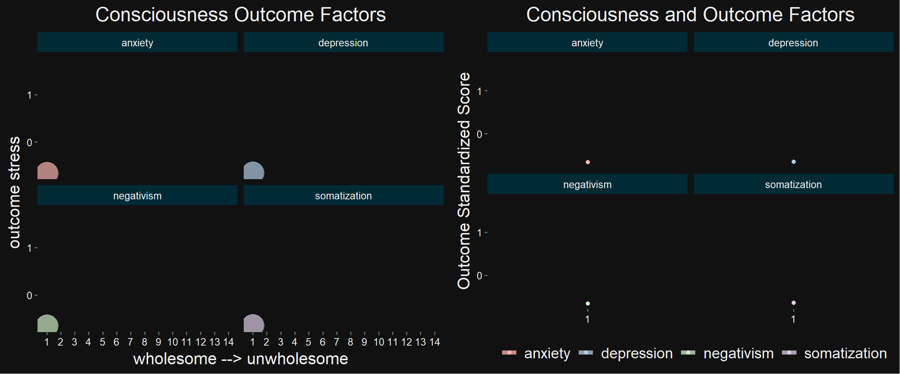
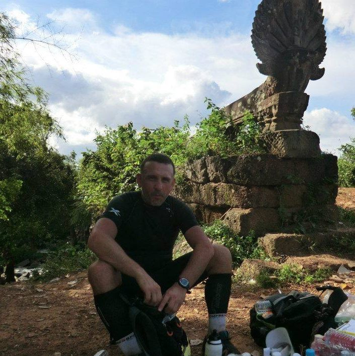
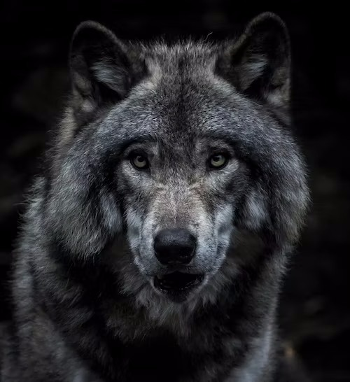

background-image: url('https://images.unsplash.com/photo-1695582341851-8cc6eba24e1a?ixlib=rb-4.0.3&ixid=M3wxMjA3fDB8MHxlZGl0b3JpYWwtZmVlZHwyNHx8fGVufDB8fHx8fA%3D%3D&auto=format&fit=crop&w=500&q=60')
background-size: cover


<h1 id="head-title">.title[The Vibrational Mind<br>by<br>Edward Hillenaar</h1>

]
<link rel="preconnect" href="https://fonts.googleapis.com">
<link rel="preconnect" href="https://fonts.gstatic.com" crossorigin>
<link href="https://fonts.googleapis.com/css2?family=Playfair+Display+SC&family=Satisfy&display=swap" rel="stylesheet">


```{r setup, include=FALSE, warning=FALSE}
options(htmltools.dir.version = FALSE)
library(ggplot2)
library(palmerpenguins)
library(kableExtra)
library(tidyverse)
library(xaringanExtra)
library(xaringanthemer)
library(DT)
library(vembedr)
library(emoji)
use_tile_view()
#remotes::install_github('yihui/xaringan', upgrade = TRUE, force = T)
```

```{r xaringan-themer, include=FALSE, warning=FALSE}
library(xaringanthemer)
style_mono_accent(
  base_color = "#1c5253",
  header_font_google = google_font("Josefin Sans"),
  text_font_google   = google_font("Montserrat", "300", "300i"),
  code_font_google   = google_font("Fira Mono")
)
```

```{css, echo=FALSE}
.remark-slide-content {
  color: black;
  background-color: lightblue;
}
```

---
.edward[.center[<h1>Hi there, I'm Edward</h1>
]
]

.center[
]


---
class: top, center
background-color: black
background-size: 400px 500px
background-position: top right

# This is a second picture of a waterfall


---
class: top, left
background-color: black
background-image: url(milk.avif)
background-size: 400px 500px
background-position: top right

.shopping[<h1>Shopping list</h1>
]
.milk[<h2><ul>
  <li>kaas</li>
  <li>melk
        <ol>
          <li>volle melk</li>
          <li>halfvolle melk</li>
          <li>magere melk</li>
        </ol>
  </li>
  <li>boter</li>
</ul></h2>
]
---
class: top, center

# Incremental reveals

<h2>My name is Edward</h2>

--

<h2>I like R language</h2>

--

<h2><a href="https://www.totalegezondheid.com">This is my Website</a></h2>

---
class: top, center

# Two columns


.pull-left[
## First
```{r, out.width="67%", echo=FALSE}
knitr::include_graphics("https://images.unsplash.com/photo-1649842699527-e5b1b557e3d8?ixlib=rb-4.0.3&ixid=M3wxMjA3fDB8MHxzZWFyY2h8OHx8aXJpcyUyMHZpcmdpbmljYXxlbnwwfHwwfHx8MA%3D%3D&auto=format&fit=crop&w=500&q=60")
```
]


.pull-right[
## Second
```{r, echo=FALSE, fig.retina=3}
iris %>% 
  ggplot(aes(Petal.Length, Petal.Width, col = Species)) +
  geom_point(size = 4)
```
]

---
class: top, center

<h1>Plot iris data</h1>

```{r echo=FALSE, fig.retina=3, fig.height=6, fig.width=10, dev='svg'}
iris %>% 
  ggplot(aes(Petal.Length,Petal.Width, color = Species)) +
  geom_point(size = 3)
```

---

## Panelset with Iris Data

```{r, echo = FALSE}
xaringanExtra::use_panelset()
```

.panelset[
.panel[.panel-name[Iris]

```{r, out.width="80%", echo=FALSE}
knitr::include_graphics("https://images.unsplash.com/photo-1540163502599-a3284e17072d?ixlib=rb-4.0.3&ixid=M3wxMjA3fDB8MHxzZWFyY2h8NHx8aXJpc3xlbnwwfHwwfHx8MA%3D%3D&auto=format&fit=crop&w=500&q=60")
```
]

.panel[.panel-name[Code]

```{r panel-chunk, fig.show='hide'}
iris %>% 
  group_by(Species) %>% 
  summarise_all(.funs = mean) 

plot <- ggplot(data = iris, aes(x = Petal.Length,
            y = Petal.Width, 
            col = Species, 
            shape = Species)) +
        geom_point(size = 5)
```
]

.panel[.panel-name[Data]
```{r echo=FALSE, eval=require('DT'), tidy=FALSE}
# iris %>% 
#   head(10) %>% 
#   kbl()
table2 <- datatable(iris,
  fillContainer = FALSE, options = list(pageLength = 8))
table2
```
]

.panel[.panel-name[Mean]
```{r echo=FALSE}
table1 <- iris %>% 
  group_by(Species) %>% 
  summarise_all(.funs = mean) %>% 
  datatable()
table1
```
]

.panel[.panel-name[Plot]

```{r echo=FALSE, fig.retina=3, fig.height=6, fig.width=10, dev='svg'}
plot
```
]
]

---
class: center, top
background-image: url(iris.avif)
background-size: contain

.beautiful[<h1>Beautiful Iris</h1>
]

---
class: center

.consciousness[<h1>Consciousness and Outcome Factors</h1>
]

```{r, out.width="80%", echo=FALSE}

```

---
class: center, middle

```{r embed_youtube, echo=FALSE, out.width="100%"}
embed_youtube(
"NHMip21Hkp0",
width = 900,
height = 700,
ratio = c("16by9", "4by3"),
frameborder = 0,
allowfullscreen = TRUE,
query = NULL
)
```

---

background-image: url('https://images.unsplash.com/photo-1695582341851-8cc6eba24e1a?ixlib=rb-4.0.3&ixid=M3wxMjA3fDB8MHxlZGl0b3JpYWwtZmVlZHwyNHx8fGVufDB8fHx8fA%3D%3D&auto=format&fit=crop&w=500&q=60')
background-size: cover


# Nice picture

---

# Footnotes in Xaringan

<h5>.footnote[Dit is een willekeurige footnote in Xaringan. Het slaat helemaal nergens op wat ik hier nu schrijf,<br>maar het is bedoeld om jullie een beeld te geven van hoe je footnotes in Xaringan noteert]</h5>

---
# https://github.com/hadley/emo

# Add emojis `r emo::ji("smile")`, `r emo::ji("poop")`, `r emo::ji("cry")`

---


```{r echo=FALSE}
table1 <- iris %>% 
  group_by(Species) %>% 
  summarise_all(.funs = mean) %>% 
  datatable()
table1
```
table1: `r table1`

---
class: center

<h1><span style="color:blue">Average Values in Iris Data</h1></span><br>

<h3>- Petal length: <span style="color:blue">`r round(mean(iris$Petal.Length),1)`</span></h3>
<h3>- Petal width: <span style="color:blue">`r round(mean(iris$Petal.Width),1)`</span></h3>
<h3>- Sepal length: <span style="color: blue">`r round(mean(iris$Sepal.Length),1)`</span></h3>
<h3>- Sepal width: <span style="color:blue">`r round(mean(iris$Sepal.Width),1)`</span></h3>
<h3>- The sample of iris data is $n =$ <span style="color:blue">`r nrow(iris)`</span>

---

<h1>My top 5 Favourite Websites</h1>
<!-- Write your code below -->
<ol>
 <h2><li><a href="https://www.totalegezondheid.com">Total Health International</a></li>
    <li><a href="https://www.totalegezondheid.nl">Total Health Netherlands</a></li>
    <li><a href="https://unsplash.com/">Unsplash</a></li>
    <li><a href="https://github.com/">Github Dashboard</a></li>
    <li><a href="https://app.netlify.com/teams/edwardhill15/overview">My Netlify Account</a></li></h2>
</ol>

---

<h1>Ordered list start from 5</h1>
<ol start="5">
 <h2><li><a href="https://www.totalegezondheid.com">Total Health International</a></li>
    <li><a href="https://www.totalegezondheid.nl">Total Health Netherlands</a></li>
    <li><a href="https://unsplash.com/">Unsplash</a></li>
    <li><a href="https://github.com/">Github Dashboard</a></li>
    <li><a href="https://app.netlify.com/teams/edwardhill15/overview">My Netlify Account</a></li></h2>
</ol>

---
class: center

# Use website www.picsum.photos to visualize random photos as placeholders


---

.pull-left[<h1>It's my Birthday!</h1>

<h2>On the 15th December</h2>


]

.pull-right[<h3>What to bring:</h3>

<ul>
    <h3><li>Baloons (I love Baloons)</li>
    <li>Cake (I'm really good at eating)</li>
    <li> An Appetite (There will be lots of food)</li></h3>
</ul>

<h3>This is where you need to go:</h3>

<h3><a href="https://maps.app.goo.gl/BTaBoVzWwMnWXuP38" >My address </a></h3>
]

---
class: center

<h1 class="welcome-website">Welcome to My Website!</h1>
<!-- Add an image of yourself that links to the about page -->


<h2><a href="https://maps.app.goo.gl/BTaBoVzWwMnWXuP38" ><h3 class="Ed-home">This is is where I live</h3> </a></h2>
<!-- Add a link to your contact me page here -->

---
class: center

<h1>Welcome to My Website!</h1>
<!-- Add an image of yourself that links to the about page -->
<a href="public/about.html">

<h2><a href="https://maps.app.goo.gl/BTaBoVzWwMnWXuP38" ><h3>This is is where I live</h3> </a></h2>
<!-- Add a link to your contact me page here -->
<a href="./public/contact.html">Contact Me</a>  

---
class: center

<!DOCTYPE html>
<html lang="en">

<head>
  <meta charset="UTF-8">
  <title>Edward's Portfolio</title>
</head>

<body>
  <h1>Edward Hillenaar's Portfolio</h1>
  <h2>I'm a Web Developer</h2>
  <hr />
  <h3><a href="./public/movie-ranking.html">Movie Ranking Project</a></h3>
  
  <h3><a href="./public/birthday-invite.html">Birthday Invite Project</a></h3>
  
  <hr />
  <a href="./public/about.html">About Me</a>
  <a href="./public/contact.html">Contact Me</a>
</body>

</html>

---
class: center

<html lang="en">

<head>
  <meta charset="UTF-8">
  <meta name="viewport" content="width=device-width, initial-scale=1.0">
  <title>Motivation Meme</title>
  <link rel="stylesheet" href="./style.css" />
  <link rel="preconnect" href="https://fonts.googleapis.com">
  <link rel="preconnect" href="https://fonts.gstatic.com" crossorigin>
  <link href="https://fonts.googleapis.com/css2?family=Satisfy&display=swap" rel="stylesheet">
</head>

<body>

  <div class="poster">
    
    <h1>Natural Wolf</h1>
    <p>The more I learn about people, the more I like wolves</p>
  </div>
</body>

</html>


